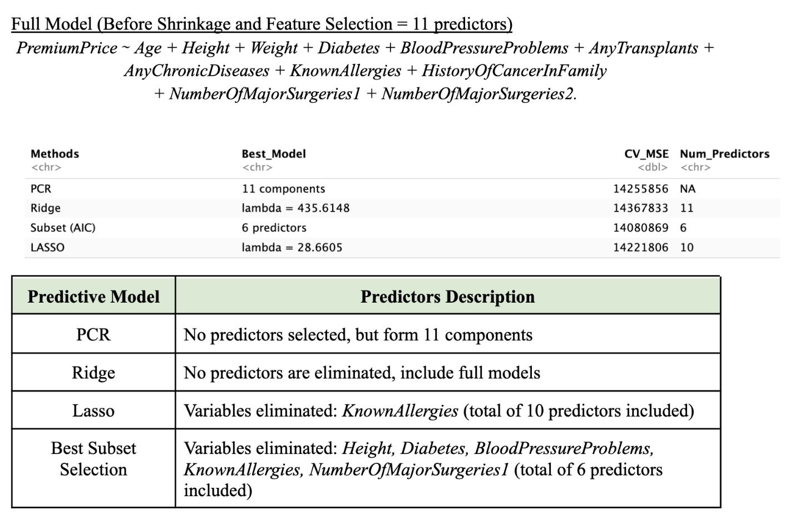

# Medical Insurance Premium Prediction
A Comparative Analysis of Regularization and Dimensionality Reduction Techniques

## Problem Statement
Accurately estimating medical insurance premiums is a balancing act between predictive accuracy and model interpretability. Insurers need models that are precise enough to manage financial risk but transparent enough to justify pricing to regulators and customers.

This project evaluates four supervised learning strategies to predict annual premiums (in INR) based on a customer's demographic and medical risk profile, specifically addressing the challenges of multicollinearity and high-dimensional health data.

## Methodology

The core objective was to determine which statistical method best captures the relationship between health indicators and costs:

(1) Addressing Multicollinearity: Health factors (like age and surgery history) are often correlated. I tested Ridge and PCR to see if stabilizing these relationships improved performance.

(2) Seeking Sparsity: In an actuarial context, simpler models are easier to audit. I used Lasso and Best Subset Selection to identify the "vital few" predictors.

(3) Validation: Used 10-fold Cross-Validation (CV) as the gold standard for estimating out-of-sample error, ensuring the results weren't just "noise" from the synthetic dataset.

In particular:
- Regression Techniques: Ridge (L2), Lasso (L1), Principal Components Regression (PCR), and Best Subset Selection.
- Languages/Libraries: R (glmnet for regularization, pls for PCR, leaps for subset selection).
- Pre-processing: Feature scaling for continuous variables (Age, Height, Weight) and dummy encoding for categorical medical history.
- Metric: Mean Squared Error (MSE) via 10-fold CV.

## Dataset
I used the public dataset originally released on Kaggle designed as a teaching resource for predictive modeling. The dataset contains 986 observations with 11 primary predictors:
- Continuous: Age, Height, Weight.
- Binary/Categorical: Diabetes, Blood Pressure, Transplants, Chronic Diseases, Allergies, Cancer History, and Major Surgeries (collapsed into 0, 1, and 2+ levels).

## Results & Key Findings
(1) The Winner: Best Subset Selection produced the lowest 10-fold CV MSE, outperforming the more complex regularization methods.

(2) Sparsity: The optimal model identified just 6 key predictors: Age, Weight, Chronic Diseases, Transplants, Family Cancer History, and having 2+ Surgeries.

(3) Quantifiable Insights: * Each additional year of age increases the annual premium by approximately 4,763 INR. A major organ transplant adds a massive premium surge of roughly 7,868 INR.

(4) Regularization Performance: Lasso eliminated only one variable (Allergies), suggesting most health indicators in the dataset provide unique predictive value.

(5) The final insurance model we identified is as follow:

## Discussion
(1) Interpretability vs. Accuracy: While PCR utilized all 11 components, it offered zero interpretability. Best Subset Selection provided a "Sparse Model" that is much more actionable for an insurance provider.

(2) Actuarial Implications: The findings suggest that insurance risk in this dataset is driven more by catastrophic history (transplants/surgeries) and age-related degradation than by minor conditions like allergies.

(3) Limitations: As the dataset is synthetic, the model assumes a linear relationship. Future work could involve Generalized Additive Models (GAMs) to capture non-linear effects of BMI or Age.

## Resources
- Medicalpremium.csv: Original dataset downloadable from Kaggle [https://www.kaggle.com/datasets/tejashvi14/medical-insurance-premium-prediction/data].
- insurance_report.pdf & insurance_report.md: The full academic report of the study.
- insurance_code.rmd: The RMD R file containing the codes used to replicate the results.

## Acknowledgement
Special credit to Adam Yang, Guanzhong Wang, Janice Shen and Jimmy Hong for completing the project together.

